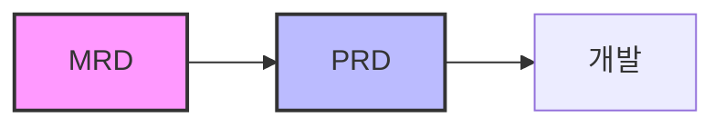

# AI 증강 MRD: 데이터 기반 제품 전략을 위한 청사진

## 섹션 0: MRD 사용방법

```
MRD를 만들려고 해. @AGENTS.md를 활용하여, MRD를 만들어줘:

제품명: CodeReview AI
특징:

Cursor 사용자로서 친숙한 개발 도구 영역
AI/ML 트렌드와 잘 맞음
명확한 타겟 고객 (개발팀)
측정 가능한 ROI (개발 시간 단축)

타겟 시장: Software Development Teams
주요 고객: 50-500명 규모 테크 기업
핵심 문제: 코드 리뷰 병목, 품질 일관성
```

---

## 섹션 1: 전략적 청사진: 시장 요구사항 문서(MRD) 해부

> 성공적인 제품 개발의 초석은 시장에 대한 깊고 정확한 이해에서 비롯됩니다. MRD는 이러한 이해를 체계화하고, 제품 개발의 모든 단계에서 '북극성' 역할을 수행하는 핵심 전략 자산입니다.

### 1.1. MRD 정의: 시장과 전략을 잇는 다리

**시장 요구사항 문서(MRD)란?**
- 특정 제품이 해결하고자 하는 시장의 요구(needs)와 문제(problems), 그리고 대상 고객을 상세히 정의하는 문서
- 제품 개발의 '왜'와 '누구를 위해'를 명확히 하는 전략적 청사진
- 제품의 모든 측면이 회사의 비즈니스 목표 및 시장 기대치와 일관성을 유지하도록 보장

| **MRD의 핵심 이점** | **설명** |
|---|---|
| **전략적 정렬** | 제품 개발을 상위 비즈니스 전략과 연결하여 모든 기능이 명확한 목적을 갖도록 보장 |
| **위험 감소** | 철저한 시장 조사를 통해 시장이 원하지 않는 제품 개발 위험을 근본적으로 완화 |
| **자원 최적화** | 명확하게 정의된 시장 요구와 우선순위를 바탕으로 한정된 자원을 효과적으로 배분 |
| **이해관계자 커뮤니케이션** | 다양한 이해관계자 간 공통된 이해 기반 마련 및 원활한 협업 촉진 |

> **💡 핵심 통찰**: MRD의 진정한 가치는 문서 그 자체보다 작성 과정에서 이루어지는 '강제된 정렬(enforced alignment)'에 있습니다. 이 과정은 조직 내 사일로를 허물고 팀 간 중요한 대화를 촉발하는 강력한 메커니즘으로 작동합니다.

### 1.2. 핵심 제품 문서 구별하기: MRD vs. PRD vs. BRD



| **문서 유형** | **핵심 질문** | **초점** | **주요 내용** |
|---|---|---|---|
| **MRD** | "이 시장의 어떤 문제를 해결해야 하는가?" | 시장의 문제와 기회 | 고객 고충, 시장 기회, 경쟁 환경 |
| **PRD** | "문제를 해결하기 위해 무엇을 만들 것인가?" | 제품의 구체적 해결책 | 기능, 사양, UX, 기술 요구사항 |
| **BRD** | "이 프로젝트로 달성할 사업 목표는?" | 비즈니스 목표와 범위 | 매출 목표, 시장 점유율, ROI |

### 1.3. MRD의 진화: 정적 유물에서 살아있는 인텔리전스 자산으로

**전통적 MRD의 한계:**
- 개발 시작 전 모든 것을 상세하게 정의하는 방대하고 정적인 문서
- 한번 작성되면 거의 변경되지 않음
- 급변하는 현대 시장 환경에 부적합

**AI가 가능하게 한 현대적 MRD:**

| **과거 (정적 MRD)** | **현재 (AI 증강 MRD)** |
|---|---|
| 특정 시점의 '역사적 스냅샷' | 실시간에 가까운 '시장 대시보드' |
| 수동 업데이트 (거의 불가능) | 자동화된 지속적 업데이트 |
| 한번 쓰고 잊히는 문서 | 영구적으로 유효한 전략 자산 |

---

## 섹션 2: AI 기반 시장 기회 및 TAM 분석

### 2.1. 시장 환경 분석 자동화

**AI 기반 리서치 도구의 혁신:**

- **Perplexity AI, SKY MCP**: 자연어 처리(NLP)를 활용한 실시간 정보 추출
- **작업 시간 단축**: 며칠 → 몇 분
- **객관성 향상**: 분석가의 주관 개입 최소화

```
사용자 입력: "클라우드 서비스 시장의 2025년 주요 성장 동력은?"
↓
AI 분석: 수백 건의 보고서와 기사 실시간 분석
↓
구조화된 출력: 핵심 동인, 시장 규모 예측, 주요 기업 동향
```

### 2.2. 예측적 트렌드 분석 및 기회 식별

**패러다임 전환:**

| **서술적 분석** | **예측적 분석** |
|---|---|
| "현재 시장은 어떠한가?" | "미래 시장은 어떻게 될 것인가?" |
| 현재 상황 설명 | 18-24개월 후 시장 예측 |
| 정적 데이터 기반 | 실시간 데이터 스트림 종합 |

**AI 도구 활용 사례:**
- **Glimpse, Google Trends**: 소셜 미디어, 검색어 데이터 실시간 분석
- **초기 신호 포착**: 주류 시장 확산 전 트렌드 발견
- **구조화된 우연성**: 예상치 못한 연결점 발견

### 2.3. 동적 전체 시장 규모(TAM) 분석

**전통적 TAM vs AI 기반 동적 TAM:**

```
전통적 TAM = 잠재 고객 수 × 고객당 평균 연간 수익
(정적인 현재 시점 스냅샷)

AI 기반 동적 TAM = f(거시경제, 기술채택률, 소비자행동, 인구통계...)
(미래 변화를 반영한 시나리오별 예측)
```

**AI 모델이 고려하는 변수들:**
- 거시 경제 지표 (GDP 성장률, 이자율)
- 신기술 채택률
- 소비자 행동 데이터
- 인구 통계학적 변화
- 정책 및 규제 변화

---

## 섹션 3: 정밀 타겟팅: AI를 활용한 시장 세분화 및 페르소나 개발

### 3.1. 데이터 기반 고객 세분화

**AI가 발견하는 행동 기반 세그먼트:**

| **세그먼트** | **특징** | **활용 방안** |
|---|---|---|
| **파워 유저** | 거의 모든 기능을 매일 사용 | 프리미엄 기능 타겟팅 |
| **핵심 기능 사용자** | 1-2개 기능만 집중 사용 | 핵심 기능 개선 집중 |
| **탐색적 사용자** | 다양한 시도, 얕은 사용 | 온보딩 개선 필요 |
| **이탈 위험 사용자** | 사용 빈도 점진적 감소 | 재활성화 캠페인 |

### 3.2. AI를 활용한 풍부하고 실행 가능한 페르소나 생성

**AI 페르소나 생성기가 자동으로 채워넣는 항목들:**

- **목표 (Goals)**: 개인적/직업적 달성 목표
- **도전 과제 (Challenges)**: 목표 달성 방해 요인
- **동기 (Motivations)**: 행동 유발 요인
- **신뢰 정보 채널**: 정보 획득 및 신뢰 경로

> **주요 도구**: HubSpot, Wyzowl, LiveChatAI

### 3.3. AI 생성 페르소나의 검증 및 강화

**검증 프로세스:**

```
AI 생성 페르소나 (가설)
↓
실제 고객 인터뷰 (검증)
↓
동적 페르소나 (지속적 업데이트)
```

**동적 페르소나의 특징:**
- 실시간 제품 분석 데이터와 연동
- 사용자 행동 변화에 따른 자동 업데이트
- 정적 스냅샷 → 살아있는 고객 표상

---

## 섹션 4: '왜'의 발견: AI 기반 문제 공간 정의

### 4.1. 시장의 목소리를 대규모로 듣기: 비정형 데이터 집계

**주요 데이터 소스:**

| **채널** | **데이터 유형** | **가치** |
|---|---|---|
| 온라인 리뷰 | 제품 평가 및 피드백 | 직접적인 제품 개선점 |
| 고객 설문조사 | 개방형 응답 | 심층적인 요구사항 |
| 지원 티켓 | 문의/불만 사항 | 긴급한 문제점 |
| 소셜 미디어 | 댓글 및 게시물 | 실시간 감성 |
| 영업 상담 | 통화 녹취록 | 구매 결정 요인 |
| 온라인 커뮤니티 | 포럼 토론 | 사용 맥락 이해 |

### 4.2. 심층 분석을 위한 자연어 처리(NLP) 적용

#### 4.2.1. 감성 분석 (Sentiment Analysis)

**양상 기반 감성 분석(ABSA) 예시:**

```
리뷰: "이 앱의 사용자 인터페이스는 정말 훌륭하지만, 배터리 소모는 끔찍하네요."

AI 분석 결과:
- 사용자 인터페이스: +0.9 (강한 긍정)
- 배터리 소모: -0.8 (강한 부정)
```

#### 4.2.2. 토픽 모델링 (Topic Modeling)

**LDA 알고리즘을 통한 주제 자동 분류:**
- 결제 오류
- 기능 요청: 리포트 내보내기
- 온보딩 과정의 어려움
- 느린 로딩 속도

### 4.3. 정성적 데이터를 정량화하기: 고객 문제의 우선순위 결정

**정량화된 분석 결과 예시:**

| **문제 영역** | **언급 빈도** | **평균 감성 점수** | **우선순위** |
|---|---|---|---|
| 온보딩 프로세스 | 30% | -0.8 (매우 부정적) | 1순위 |
| 리포트 기능 | 15% | +0.2 (기능 추가 요청) | 2순위 |
| 모바일 앱 UI | 5% | -0.2 (약간 부정적) | 3순위 |

> **핵심 가치**: AI는 정성적 피드백을 정량화하여 제품 관리를 직관 중심에서 데이터 중심으로 전환시킵니다. 이는 "문제 A는 문제 B보다 5배 더 자주 언급되며, 부정적 감성의 가장 큰 원인"이라는 객관적 증거를 제공합니다.

---

## 섹션 5: 경쟁의 장: AI 강화 경쟁사 인텔리전스

### 5.1. 정적 보고서에서 지속적인 모니터링으로

**진화하는 경쟁 분석:**

| **전통적 방식** | **AI 기반 방식** |
|---|---|
| 분기별/반기별 수동 보고서 | 24시간 자동 모니터링 |
| 특정 시점의 스냅샷 | 실시간 변화 감지 |
| 정보의 빠른 진부화 | 항상 최신 정보 유지 |

### 5.2. AI 기반 모니터링의 핵심 영역

**모니터링 영역별 주요 도구:**

| **영역** | **도구** | **핵심 기능** |
|---|---|---|
| **제품 & 가격** | Visualping, Competely.ai | 웹사이트 변경 감지, 가격 정책 추적 |
| **마케팅 & SEO** | SEMrush, Ahrefs | 키워드 전략, 콘텐츠 성과 분석 |
| **고객 감성** | Brandwatch | 소셜 미디어 인식, 평판 분석 |

### 5.3. 인텔리전스를 실행 가능한 통찰력으로 종합하기

**AI 경쟁 인텔리전스 플랫폼 비교:**

| **도구** | **주요 기능** | **최적 사용 사례** | **가격 모델** |
|---|---|---|---|
| **Visualping** | 웹사이트 변경 실시간 감지 | 가격/제품 변화 추적 | Freemium |
| **SEMrush** | SEO 및 콘텐츠 분석 | 디지털 마케팅 전략 | 구독 기반 |
| **Crayon** | 종합 인텔리전스 및 배틀카드 | 전사적 경쟁 정보 | 맞춤형 |
| **Similarweb** | 웹 트래픽 분석 | 시장 포지셔닝 | Freemium |
| **Brandwatch** | 소셜 리스닝 | 브랜드 평판 관리 | 구독 기반 |
| **Competely.ai** | 자동화된 경쟁사 분석 | 스타트업/중소기업 | 구독 기반 |

---

## 섹션 6: 비전에서 가치로: 솔루션 및 상위 수준 기능 정의에 AI 활용하기

### 6.1. 브레인스토밍 및 아이데이션 파트너로서의 AI

**구조화된 우연성(Structured Serendipity):**

```
시장 데이터 입력
(페르소나 + 고객 고충 + 경쟁사 약점)
↓
AI 브레인스토밍 도구
(Miro AI, Ideamap.ai)
↓
혁신적 기능 아이디어
(데이터 기반 + 창의적 연결)
```

> **예시 프롬프트**: "페르소나 '바쁜 소상공인 김사장'이 '재고 관리의 어려움'이라는 문제에 대해 가장 큰 불만을 느끼고 있으며, 경쟁사들은 이 부분에 취약하다. 이 문제를 해결할 수 있는 혁신적인 기능 아이디어 5가지를 제안해 줘."

### 6.2. 데이터 기반 기능 우선순위 결정

**AI 지원 우선순위 매트릭스:**

| **프레임워크** | **평가 기준** | **AI 역할** |
|---|---|---|
| Impact vs. Effort | 영향력 대비 노력 | 고객 피드백 자동 분석 |
| RICE | 도달/영향/신뢰/노력 | 각 항목 점수 계산 |
| Risk-Reward | 위험 대비 보상 | 시나리오 분석 |

### 6.3. 제품 비전 선언문 작성

**AI 활용 비전 수립 프로세스:**

1. **컨텍스트 제공**
   - 타겟 시장
   - 핵심 문제
   - 고유 차별점

2. **AI 초안 생성**
   - 다양한 스타일과 관점
   - 여러 버전 제시

3. **인간의 다듬기**
   - 검토 및 조합
   - 감정적 공감대 추가

---

## 섹션 7: 중요한 것 측정하기: AI 지원 메트릭 및 비즈니스 케이스 수립

### 7.1. 성공 지표 및 KPI 정의

**AI 기반 KPI 발견:**

```
예시: AI 분석 결과
- '프로젝트 템플릿 사용' 기능 사용자
- 고객 이탈률 50% 감소
→ '주간 템플릿 사용률'을 핵심 KPI로 설정
```

### 7.2. AI 기반 수익 예측 및 가격 전략

**AI 수익 예측 모델이 고려하는 요소:**

- 과거 판매 데이터
- 시장 동향
- 거시 경제 지표
- 경쟁사 가격 변동
- 계절성 패턴

**시나리오별 예측:**
- 낙관적 시나리오
- 현실적 시나리오
- 비관적 시나리오

### 7.3. 비즈니스 케이스 구축

**데이터 기반 비즈니스 케이스 논리 흐름:**

```
1. 문제의 정량화
   "AI 분석: '데이터 연동 복잡성'으로 매달 5% 고객 이탈"
   ↓
2. 기회 규모 제시
   "TAM 분석: 데이터 통합 시장 연평균 20% 성장 예측"
   ↓
3. 솔루션 및 우선순위
   "'원클릭 데이터 통합' 기능 - 최고 영향력 점수"
   ↓
4. 수익 영향 예측
   "6개월 내: 이탈률 2%↓, 전환율 3%↑ = 연간 $X 추가 수익"
```

---

## 섹션 8: AI 증강 MRD 종합: 실용적인 워크플로우와 제품 관리자의 역할 진화

### 8.1. AI 증강 MRD를 위한 단계별 워크플로우

**8단계 실행 가이드:**

| **단계** | **활동** | **주요 도구** |
|---|---|---|
| 1. 데이터 집계 | 모든 관련 데이터 소스 수집 | CRM, 피드백 플랫폼 |
| 2. 시장 분석 | 시장 동향 및 경쟁 환경 파악 | Perplexity AI, Competely.ai |
| 3. 고객 세분화 | 세그먼트 식별 및 페르소나 생성 | HubSpot Persona Generator |
| 4. 문제 정의 | 핵심 고객 문제 정량화 | NLP 도구, 토픽 모델링 |
| 5. 솔루션 도출 | 기능 아이디어 브레인스토밍 | Miro AI |
| 6. 우선순위 결정 | 기능 순위 및 비전 수립 | ClickUp Brain |
| 7. 비즈니스 케이스 | 수익 예측 및 KPI 정의 | AI 예측 모델 |
| 8. MRD 작성 | 초안 생성 및 검증 | AI 문서 생성기 + 검토 |

### 8.2. 프롬프트의 기술: AI를 올바르게 안내하기

**효과적인 프롬프트 작성 모범 사례:**

| **원칙** | **예시** |
|---|---|
| **역할 부여** | "당신은 20년 경력의 B2B SaaS 제품 마케터입니다." |
| **명확한 컨텍스트** | 타겟 고객, 문제점, 목표 구체적 제공 |
| **구체적 형식 요구** | "표 형식으로 정리" / "SWOT 분석 형태로 작성" |
| **단계별 사고 유도** | "먼저 강점 분석 → 약점 분석 → 기회 도출" |

### 8.3. 휴먼 인 더 루프: 편향 완화 및 통찰력 검증

**제품 관리자의 필수 역할:**

```
AI 생성 결과
↓
인간의 비판적 검토
- 편향 확인
- 현실성 검증
- 전략적 판단
↓
최종 의사결정
```

> **주의사항**: AI는 강력한 도구이지만 만능이 아닙니다. 최종적인 전략적 판단과 책임은 전적으로 제품 관리자의 몫입니다.

### 8.4. 제품 관리의 미래: 리서처에서 인텔리전스 디렉터로

**역할 변화:**

| **과거 (리서처)** | **미래 (인텔리전스 디렉터)** |
|---|---|
| 수동적 데이터 수집 | AI 엔진 지휘 |
| 시간 소모적 분석 | 전략적 종합 |
| 제한된 데이터 처리 | 대규모 인사이트 관리 |
| 직관 기반 결정 | 데이터 기반 전략 수립 |

**새로운 핵심 역량: 비판적 종합(Critical Synthesis)**

- AI가 생성한 다양한 분석 결과를 일관된 전략으로 통합
- 모순되는 데이터 간 균형 찾기
- 부분의 합보다 큰 전체적 서사 창출

---

## 결론

> AI 시대의 제품 관리는 AI가 제공하는 속도와 규모의 이점을 활용하되, 최종적인 방향을 설정하고 가치를 창출하는 인간 고유의 전략적 판단 능력을 발휘하는 것입니다. 제품 관리자는 더 이상 외로운 연구원이 아니라, AI라는 강력한 인텔리전스 엔진을 지휘하는 '인텔리전스 디렉터'로 진화하고 있습니다.