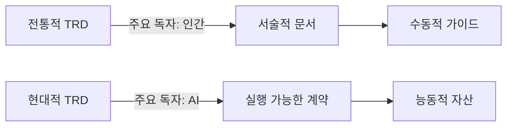
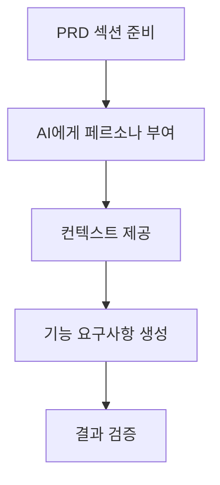
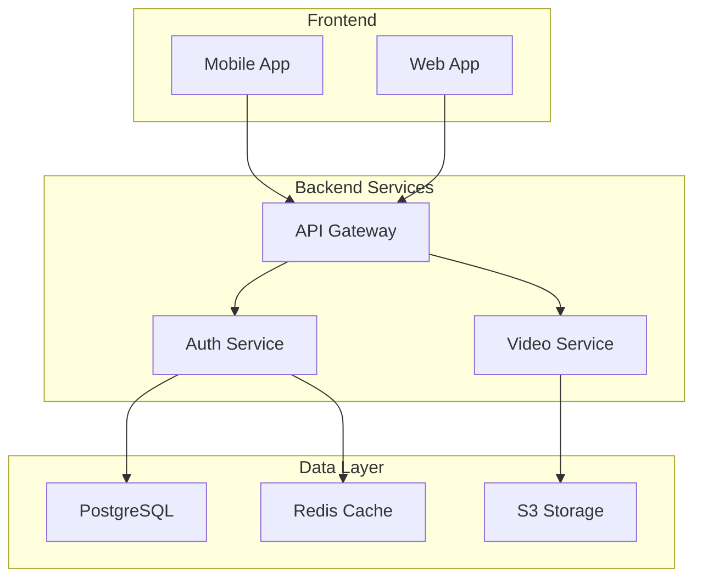
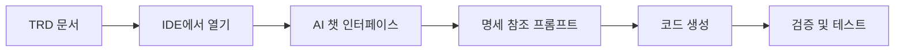

# AI 증강 TRD: 명세 기반 개발을 위한 종합 가이드

## 섹션 0: 사용 방법
### 다음 아래의 내용을 꼭 첨부를 해야합니다. 
```
## 기술 스택 확정 필요 사항

### 프론트엔드
- [ ] 프레임워크: [React/Vue/Angular/Next.js/기타]
- [ ] 상태 관리: [Redux/MobX/Zustand/Context API/기타]
- [ ] UI 라이브러리: [Material-UI/Ant Design/Tailwind CSS/기타]
- [ ] 빌드 도구: [Webpack/Vite/Turbopack/기타]

### 백엔드
- [ ] 언어: [JavaScript/TypeScript/Python/Java/Go/기타]
- [ ] 프레임워크: [Express/FastAPI/Spring Boot/Gin/기타]
- [ ] API 스타일: [REST/GraphQL/gRPC]

### 데이터베이스
- [ ] 주 데이터베이스: [PostgreSQL/MySQL/MongoDB/기타]
- [ ] 캐싱: [Redis/Memcached/없음]
- [ ] 검색 엔진: [Elasticsearch/Algolia/없음]

### 인프라
- [ ] 클라우드: [AWS/GCP/Azure/온프레미스]
- [ ] 컨테이너: [Docker/Kubernetes/없음]
- [ ] CI/CD: [GitHub Actions/Jenkins/GitLab CI/기타]

### 추가 고려사항
- [ ] 팀 규모: [인원수]
- [ ] 팀 기술 수준: [주니어/시니어 비율]
- [ ] 예산 제약: [월 예산]
- [ ] 타임라인: [개발 기간]
```


## 섹션 1: 현대적 TRD: 청사진에서 실행 가능한 계약으로

소프트웨어 개발 수명 주기(SDLC)의 초석인 기술 요구사항 문서(Technical Requirements Document, TRD)는 비즈니스 비전을 엔지니어링 실행으로 전환하는 데 있어 중추적인 역할을 수행합니다.

### 1.1 기술 요구사항 문서(TRD)의 정의

> **TRD란?**
> 
> 소프트웨어 또는 시스템 프로젝트에 필요한 모든 기술적 요구사항을 포착하고 상세히 기술하는 공식 문서입니다. 시스템이나 제품이 무엇을 해야 하는지, 어떤 기술적 세부 사항을 따라야 하는지, 그리고 어떤 제약 조건에 직면하는지를 명확하게 정의하는 구조화된 청사진 역할을 합니다.

#### TRD의 핵심 목적

| 목적 | 설명 |
|------|------|
| **기술적 범위 명확화** | 프로젝트의 기술적 경계를 명확히 설정하여 모든 참여자가 동일한 목표를 이해하도록 함 |
| **이해관계자 정렬** | 비즈니스, 제품, 개발, QA 팀 등 모든 이해관계자 간의 이해를 일치시켜 오해를 줄임 |
| **표준 참조 제공** | 시스템 설계, 구현, 테스트 단계 전반에 걸쳐 신뢰할 수 있는 단일 진실 공급원(Single Source of Truth) 역할 |
| **모호성 감소** | 개발 과정에서 발생할 수 있는 불확실성과 오해를 최소화하여 재작업 비용을 줄임 |
| **변경 관리의 기준점** | 향후 변경 요청이나 기능 확장에 대한 통제 및 관리의 기준점 |

### 1.2 패러다임 전환: 실행 가능한 명세로서의 TRD

#### 전통적 TRD vs 현대적 TRD



**명세 기반 개발(Spec-Driven Development)의 핵심**
- TRD는 AI 에이전트가 코드를 생성, 테스트, 검증하는 데 사용하는 직접적이고 실행 가능한 진실의 원천
- 문서가 매우 예측 가능하고 기계가 읽을 수 있는 형식으로 작성 필요
  - 구조화를 위한 마크다운
  - 데이터 표현을 위한 YAML
  - 다이어그램을 위한 Mermaid

### 1.3 AI 기반 워크플로우의 핵심 이점

| 이점 | 설명 |
|------|------|
| **모호성 감소** | 정밀하고 기계가 읽을 수 있는 TRD는 인간과 AI 개발자 모두에게 오해의 소지를 최소화하고 재작업을 줄여줌 |
| **범위 이탈 완화** | 명확한 기술적 경계를 사전에 설정함으로써 계획되지 않은 기능이나 변경 사항이 개발 과정에 스며드는 것을 방지 |
| **추적성 강화** | PRD에 명시된 상위 수준의 비즈니스 목표부터 특정 기술 구현 및 테스트까지 명확하고 감사 가능한 연결 고리 생성 |

---

## 섹션 2: AI 증강 TRD 설계: 모듈식 프레임워크

### 2.1 AI 친화적 TRD의 핵심 구성 요소

#### TRD 구조

1. **서론 및 개요 (Introduction & Overview)**
   - 목적, 범위, 대상 독자
   - 정의, 두문자어, 약어

2. **시스템 아키텍처 및 설계 제약**
   - 고수준 아키텍처
   - 기술 스택(Tech Stack)
   - 설계 제약

3. **기능 요구사항 (Functional Requirements)**
   - 시스템이 '무엇을 해야 하는지' 상세 기술
   - 고유 ID, 명확한 설명, 관련 사용자 스토리 포함

4. **비기능 요구사항 (Non-Functional Requirements, NFRs)**
   - 성능, 보안, 확장성, 신뢰성
   - 가용성, 사용성, 접근성, 규정 준수

5. **데이터 모델 및 스키마**
   - ERD(Entity-Relationship Diagram)
   - SQL DDL

6. **API 명세**
   - OpenAPI (Swagger) 명세
   - 엔드포인트, HTTP 메서드, 요청/응답 형식

7. **인수 기준 및 테스트 요구사항**
   - "Given-When-Then" 형식
   - QA 및 자동화된 테스트 케이스

8. **가정, 제약, 의존성**
   - 기술적/비즈니스적 제약
   - 외부 시스템 의존성

### 2.2 기계 가독성을 위한 구조화

> **핵심 원칙**
> 
> - **마크다운 활용**: 명확한 제목 계층(H1, H2, H3), 목록, 표 사용
> - **코드 블록 사용**: Mermaid, YAML, JSON, SQL DDL 등을 지정된 언어 태그와 함께 배치
> - **일관된 형식**: 문서 전체에 걸쳐 일관된 용어와 형식 사용

### 표 2.1: TRD 작성을 위한 AI 툴링 매트릭스

| TRD 섹션 | 주요 작업 | 권장 AI 도구 | 샘플 프롬프트 |
|----------|-----------|--------------|---------------|
| **요구사항 생성** | PRD로부터 기능/비기능 요구사항 추출 | OpenAI GPT-4, Anthropic Claude 3 | Act as a senior systems analyst... |
| **시스템 아키텍처** | 요구사항 기반 아키텍처 제안 | OpenAI GPT-4, Claude 3 | Act as a cloud solutions architect... |
| **데이터 모델링** | 엔터티 및 관계 정의 | OpenAI GPT-4, SQLAI.ai | Generate SQL DDL for PostgreSQL... |
| **API 명세** | OpenAPI 명세 생성 | GitHub Copilot Chat | Generate OpenAPI 3.0 specification... |
| **다이어그램 작성** | 아키텍처 시각화 | Mermaid Chart AI | Generate Mermaid.js ERD... |
| **테스트 케이스** | 단위/통합 테스트 도출 | GitHub Copilot, aqua AI | Generate unit tests using pytest... |

---

## 섹션 3: 프롬프트 엔지니어링: 기술 명세 작성을 위한 핵심 역량

### 3.1 체계적인 프롬프트 엔지니어링의 원칙

#### 핵심 원칙

| 원칙 | 설명 | 예시 |
|------|------|------|
| **페르소나 패턴** | AI에게 특정 전문가 역할 부여 | "마이크로서비스를 전문으로 하는 수석 시스템 아키텍트 역할을 수행하라" |
| **풍부한 컨텍스트 제공** | 관련 배경 정보 최대한 제공 | PRD, 사용자 스토리, 기존 코드, 비즈니스 제약 조건 포함 |
| **구조화된 추론 요구** | 결과에 도달하는 과정 설명 요구 | "단계별로 생각하며", "장단점을 분석하며" |

### 3.2 고급 프롬프팅 기법

#### 주요 기법

1. **레시피 패턴 (Recipe Pattern)**
   ```
   1. 제공된 요구사항을 분석하라
   2. 주요 구성 요소를 식별하라
   3. 각 구성 요소의 책임을 정의하라
   4. 구성 요소 간의 상호작용을 설명하라
   ```

2. **제로샷 vs. 퓨샷 프롬프팅**
   - **제로샷**: 예시 없이 직접적인 요청
   - **퓨샷**: 한두 개의 예시를 제공하여 원하는 결과물의 형식과 스타일 명확화

3. **출력 형식 명시**
   - "결과물은 마크다운 테이블 형식으로 제공하라"
   - "유효한 OpenAPI 3.0 YAML을 생성하라"

### 표 3.1: COSTAR 프롬프팅 프레임워크

| 구성 요소 | 설명 | TRD 작성 예시 |
|-----------|------|---------------|
| **Context** | AI가 작업을 이해하는 데 필요한 배경 정보 | "You are developing a B2B SaaS platform..." |
| **Objective** | AI가 수행해야 할 구체적인 작업 | "Generate comprehensive NFRs..." |
| **Style** | 원하는 결과물의 문체나 형식 | "Formal and technical..." |
| **Tone** | 결과물이 전달해야 할 분위기 | "Authoritative and prescriptive..." |
| **Audience** | 결과물을 소비할 주체 | "Senior software engineers..." |
| **Response** | 원하는 출력물의 정확한 구조 | "Markdown table with three columns..." |

---

## 섹션 4: AI를 활용한 요구사항 생성

### 4.1 PRD에서 기능 요구사항으로

#### 워크플로우



#### 프롬프트 예시

```markdown
Act as a senior business analyst. Analyze the following PRD section on 'User Profile Management.' 
Decompose it into a detailed list of functional requirements.

For each requirement, provide:
- Unique ID (e.g., FR-PROF-001)
- Concise description
- Corresponding user story

Output: Markdown table with columns 'ID', 'Description', 'Source User Story'
```

### 4.2 AI를 통한 비기능 요구사항(NFRs) 발굴

#### NFR 카테고리별 프롬프트

| 카테고리 | 프롬프트 핵심 요소 | 참조 표준 |
|----------|-------------------|-----------|
| **성능** | 측정 가능한 목표 (latency, throughput) | 업계 벤치마크 |
| **보안** | OWASP Top 10 원칙 | OWASP, ISO 27001 |
| **접근성** | WCAG 2.1 AA 표준 | WCAG 가이드라인 |

### 4.3 우선순위 지정 및 검증

#### MoSCoW 방법론 적용

```markdown
- Must-have: 핵심 기능
- Should-have: 중요하지만 필수는 아님
- Could-have: 있으면 좋은 기능
- Won't-have: 이번 릴리스에서 제외
```

---

## 섹션 5: AI 주도 아키텍처 및 설계 시각화

### 5.1 고수준 시스템 아키텍처 생성

#### 아키텍처 프롬프트 구조

```markdown
Act as a principal cloud solutions architect specializing in scalable media platforms.

Based on requirements:
- High concurrency (100K users)
- Global availability with low latency
- SOC 2 compliance
- Real-time data processing

Propose architecture including:
1. Major components (API Gateway, Lambda, etc.)
2. Component responsibilities
3. Communication patterns
4. Service justification
5. Key tradeoffs
```

### 5.2 AI 지원 기술 스택 선택

#### 기술 스택 비교 매트릭스

| 평가 기준 | FastAPI | Django | Express.js |
|-----------|---------|--------|------------|
| **성능** | 높음 | 중간 | 높음 |
| **개발 속도** | 빠름 | 보통 | 빠름 |
| **생태계 성숙도** | 성장중 | 매우 성숙 | 매우 성숙 |
| **팀 스킬 정렬** | Python 팀에 최적 | Python 팀에 적합 | JavaScript 필요 |

### 5.3 코드로서의 아키텍처 다이어그램 생성

#### Mermaid.js 다이어그램 예시



---

## 섹션 6: API 및 데이터 스키마 정의 자동화

### 6.1 OpenAPI (Swagger) 명세 생성

#### OpenAPI 생성 워크플로우

1. 기능 요구사항 목록 추출
2. API 설계 전문가 페르소나 부여
3. OpenAPI 3.0 명세 생성
4. 검증 및 테스트

#### 프롬프트 템플릿

```yaml
openapi: 3.0.0
info:
  title: Order Management API
  version: 1.0.0
paths:
  /orders:
    post:
      summary: Create new order
      requestBody:
        required: true
        content:
          application/json:
            schema:
              $ref: '#/components/schemas/OrderCreate'
      responses:
        '201':
          description: Order created successfully
```

### 6.2 데이터베이스 스키마 생성

#### ERD to SQL DDL 변환

```sql
-- Generated from Mermaid ERD
CREATE TABLE users (
    id UUID PRIMARY KEY DEFAULT gen_random_uuid(),
    email VARCHAR(255) UNIQUE NOT NULL,
    password_hash VARCHAR(255) NOT NULL,
    created_at TIMESTAMPTZ DEFAULT CURRENT_TIMESTAMP
);

CREATE TABLE orders (
    id UUID PRIMARY KEY DEFAULT gen_random_uuid(),
    user_id UUID NOT NULL REFERENCES users(id) ON DELETE CASCADE,
    status VARCHAR(50) NOT NULL,
    created_at TIMESTAMPTZ DEFAULT CURRENT_TIMESTAMP
);

-- Indexes for performance
CREATE INDEX idx_orders_user_id ON orders(user_id);
CREATE INDEX idx_orders_status ON orders(status);
```

---

## 섹션 7: AI 부조종사로서의 TRD

### 7.1 명세 기반 코드 생성

#### GitHub Copilot 활용 워크플로우



#### IDE 프롬프트 예시

```markdown
@workspace #file:trd.md

Using the OpenAPI specification in `trd.md` for POST /orders endpoint:
1. Use Pydantic models for validation
2. Implement database interaction logic
3. Include error handling (400, 500)
4. Return 201 status on success
```

### 7.2 인수 기준으로부터 단위 테스트 생성

#### 테스트 생성 프롬프트

```python
# Acceptance Criteria to Test
"""
AC-AUTH-001: Valid credentials → JWT token
AC-AUTH-002: Invalid password → 401 error
AC-AUTH-003: Non-existent user → 401 error
AC-AUTH-004: Rate limiting → 429 error
"""

# Generate comprehensive pytest suite
def test_valid_login():
    # Test implementation
    pass

def test_invalid_password():
    # Test implementation
    pass
```

### 7.3 완전한 추적 가능 개발 주기

#### 추적성 체인

| 단계 | 입력 | 출력 | AI 역할 |
|------|------|------|----------|
| **1. 비즈니스 요구** | PRD | 기능 요구사항 | 요구사항 추출 |
| **2. 기술 명세** | 요구사항 | TRD | 명세 생성 |
| **3. 코드 구현** | TRD | 애플리케이션 코드 | 코드 생성 |
| **4. 테스트 검증** | 인수 기준 | 테스트 코드 | 테스트 생성 |

---

## 결론

### 핵심 결론

1. **TRD의 진화**
   - 정적인 청사진 → 동적인 실행 가능한 계약
   - 인간 독자 중심 → AI 에이전트 중심

2. **핵심 역량의 전환**
   - 문서 작성 → 프롬프트 엔지니어링
   - 부실한 프롬프트 = 기술 부채

3. **AI의 강점**
   - 체계적인 NFR 발굴
   - 버전 관리 가능한 설계 자산 생성

4. **완전한 추적 가능성**
   - 비즈니스 요구 → TRD → 코드 → 테스트
   - 단일 진실 공급원으로서의 TRD

### 권장 사항

| 영역 | 권장 사항 |
|------|-----------|
| **조직 차원** | TRD를 핵심 자산으로 인식하고 투자 확대 |
| **프로세스** | TRD를 소스 코드처럼 관리 (버전 관리, 리뷰) |
| **역량 개발** | 기술 전문가의 프롬프트 엔지니어링 교육 |
| **문화** | TRD 품질과 명확성을 최우선 가치로 |

> **최종 메시지**
> 
> AI 시대의 성공적인 소프트웨어 개발을 위해서는 TRD를 자동화된 소프트웨어 공장의 핵심 설계도이자 가장 중요한 자산으로 관리하는 문화가 필수적입니다.