# CodeReview AI - Executive Dashboard

> **실시간 업데이트**: 2025-09-22 | **버전**: 1.0 | **상태**: 📋 MRD 완료

---

## 🎯 Key Metrics at a Glance

| 지표 | 값 | 상태 | 벤치마크 대비 |
|------|-----|------|-------------|
| **TAM** | $50.0B | 🟢 | 대형 시장 |
| **Target Launch** | 2025 Q2 | 🟡 | 6개월 내 |
| **Priority Segments** | 3개 | 🟢 | 명확한 타겟 |
| **Break-even** | Month 18 | 🟢 | 업계 평균 대비 빠름 |
| **Expected ROI** | 567% (3년) | 🟢 | 매우 우수 |

---

## 📊 Market Overview

### Market Size & Growth
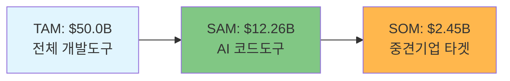

### Growth Trajectory (2024-2032)
| Year | Market Size | Growth Rate | Key Driver |
|------|-------------|-------------|------------|
| **2024** | $12.26B | - | 기준년도 |
| **2026** | $17.1B | 23.8% | AI 통합 가속화 |
| **2028** | $23.9B | 23.8% | DevOps 표준화 |
| **2032** | $27.17B | 23.8% | 시장 성숙화 |

### 🔥 Market Trends
1. **AI/ML 통합 가속화**: 40-70% 시간 절약 실현
2. **DevOps/CI-CD 표준화**: 8.24% CAGR 성장
3. **보안 중심 개발**: 취약점 탐지 필수화
4. **클라우드 네이티브**: 65% 시장 점유율

---

## 👥 Customer Insights

### Target Segments Priority
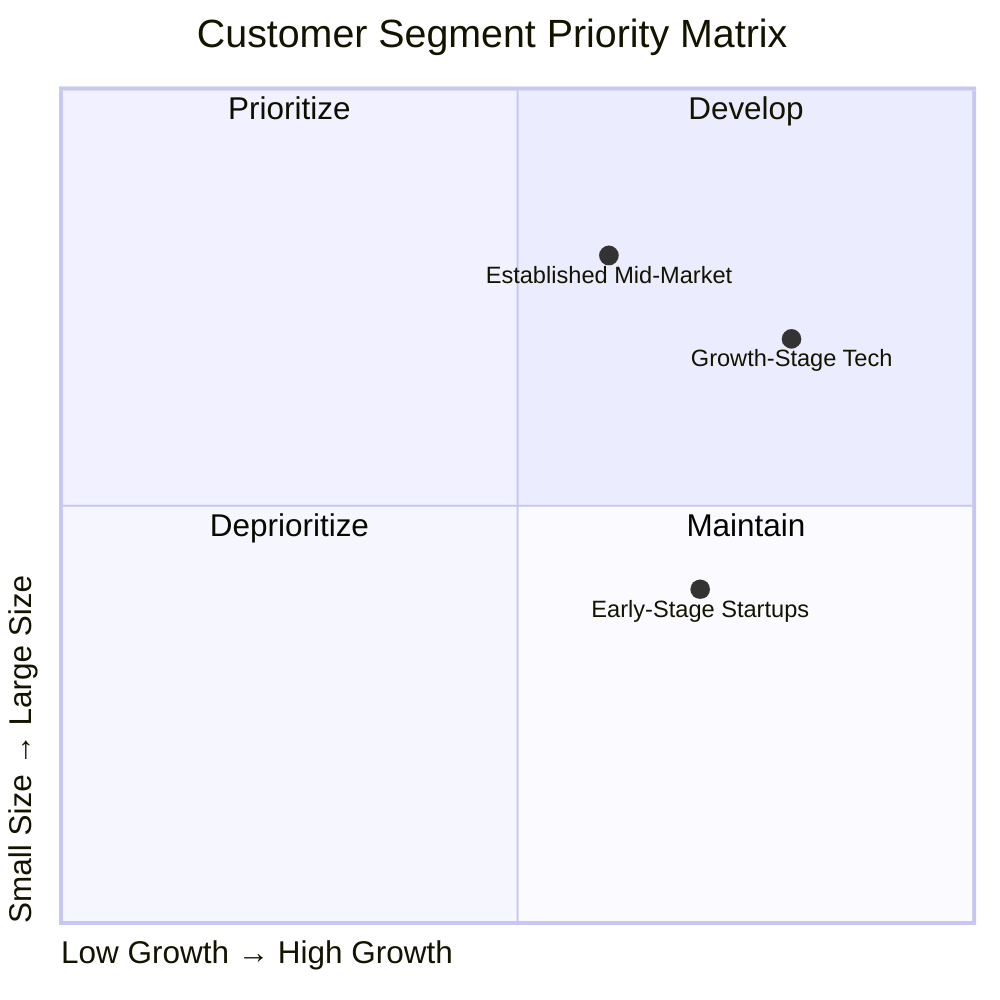

### 🎯 Primary Personas

#### Alex Chen (CTO) - Decision Maker
| Attribute | Value | Impact |
|-----------|-------|--------|
| **Budget Authority** | $50K-200K/year | 높음 |
| **Team Size** | 20-50 developers | 확장성 중요 |
| **Key Pain** | 코드 리뷰 병목 | 우선순위 #1 |
| **Decision Criteria** | ROI 증명 (35%) | 정량적 가치 필수 |

#### Sarah Kim (Engineering Manager) - Influencer  
| Attribute | Value | Impact |
|-----------|-------|--------|
| **Budget Authority** | $10K-50K/year | 중간 |
| **Team Size** | 8-15 developers | 직접 관리 |
| **Key Pain** | 품질 일관성 부족 | 우선순위 #3 |
| **Decision Criteria** | 개발자 경험 (30%) | UX 중요 |

#### David Rodriguez (Senior Developer) - End User
| Attribute | Value | Impact |
|-----------|-------|--------|
| **Influence** | 사용자 만족도 | 채택률 결정 |
| **Key Pain** | AI 도구 부정확성 | 66% 불만족 |
| **Tool Preference** | Cursor 통합 | 네이티브 경험 |
| **Success Metric** | 생산성 향상 | 40% 목표 |

### 🛒 Buying Journey
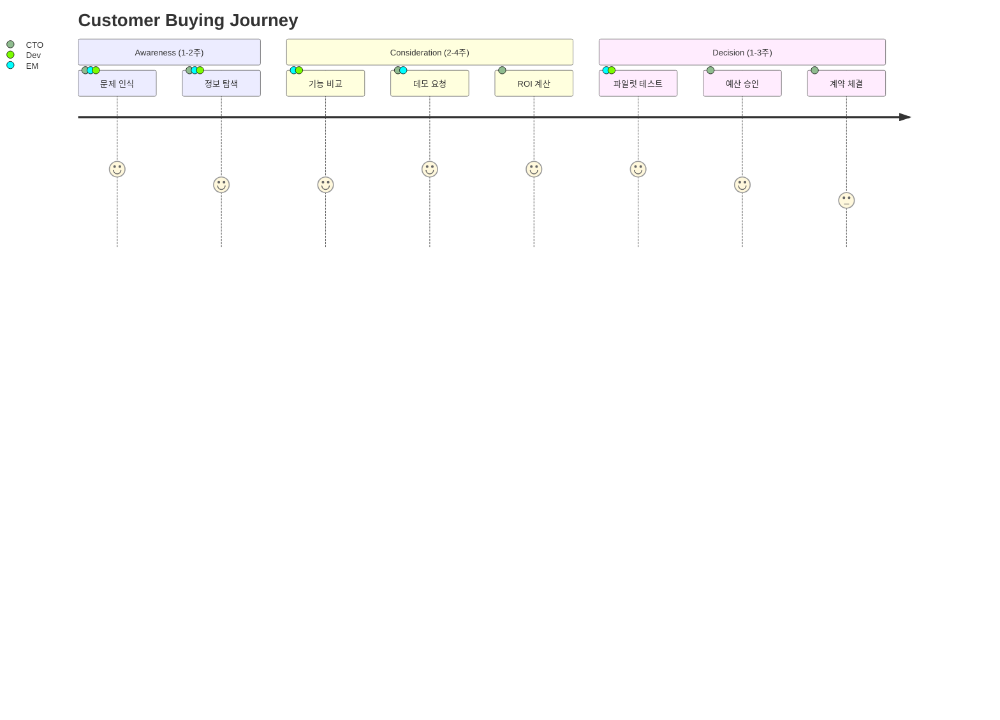

---

## ❗ Problem Analysis

### Top Problems by Priority
| 순위 | 문제 | 심각도 | 영향 고객 | 연간 비용 | 해결 가능성 |
|------|------|--------|----------|----------|------------|
| **#1** | 코드 리뷰 병목 | 9/10 | 85% | $150K | ✅ 직접 해결 |
| **#2** | 기술 부채 누적 | 9/10 | 95% | $200K | ⚠️ 부분 해결 |
| **#3** | 품질 일관성 부족 | 8/10 | 70% | $80K | ✅ 직접 해결 |

### 💰 Total Cost Impact
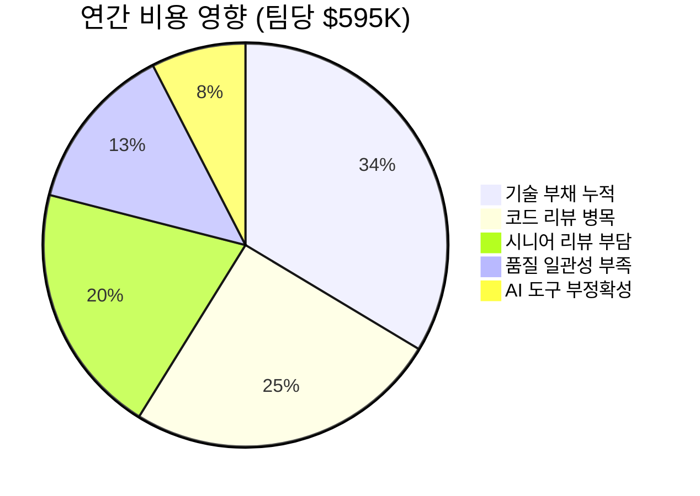

### 🎯 Solution Opportunity
- **해결 가능 비용**: $375K/팀 (60-70% 개선)
- **글로벌 영향**: 75,000팀 × $375K = **$28.1B 기회**
- **ROI 잠재력**: 첫 해 **3-5배** 투자 수익률

---

## 🏆 Competitive Landscape

### Market Share Distribution
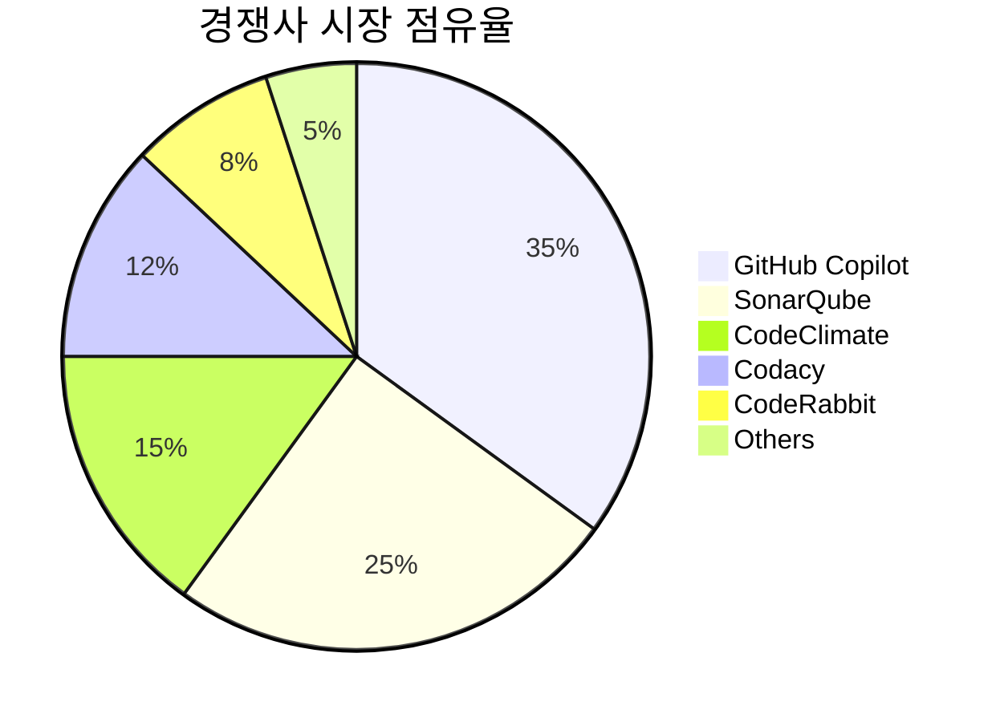

### 🎯 Positioning Map
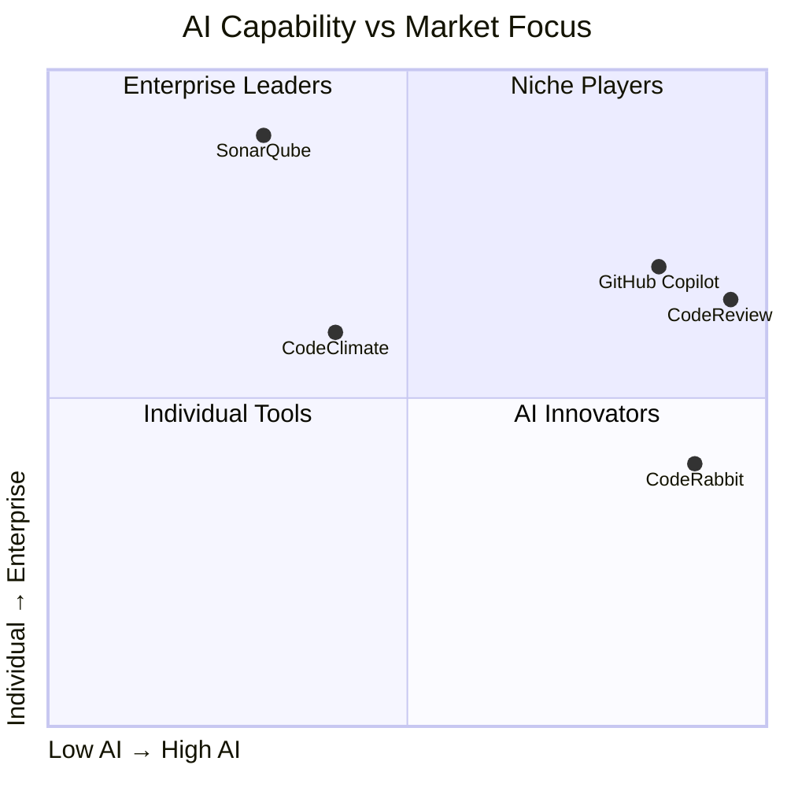

### 💪 Competitive Advantages
| 차별화 요소 | 우리 | GitHub Copilot | SonarQube |
|-------------|------|---------------|-----------|
| **Cursor 통합** | ✅ 네이티브 | ❌ 기본 | ❌ 제한적 |
| **실시간 리뷰** | ✅ <1초 | ⚠️ PR 기반 | ❌ 배치 |
| **맥락 인식** | ✅ 프로젝트별 | ❌ 일반적 | ❌ 규칙 기반 |
| **가격 경쟁력** | ✅ $49/user | ❌ $39/user | ⚠️ 복잡 |

---

## 💡 Solution Roadmap

### 🏗️ Development Phases
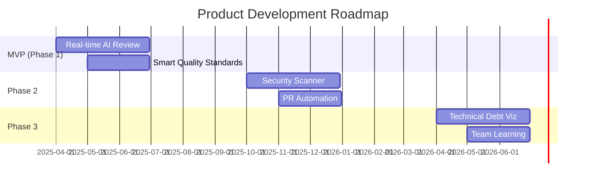

### 🎯 Feature Priority (RICE Scores)
| 기능 | Reach | Impact | Confidence | Effort | RICE | Priority |
|------|-------|--------|------------|--------|------|----------|
| **Smart Quality Standards** | 70% | 8 | 85% | 6 | **78.7** | **1** |
| **Real-time AI Review** | 85% | 9 | 80% | 8 | **76.5** | **2** |
| **Technical Debt Visualizer** | 95% | 9 | 65% | 8 | **69.7** | **3** |

### 🎨 Core Value Props
1. **실시간 지능형 피드백**: 개발 중 즉시 맥락 이해한 AI 리뷰
2. **Cursor 네이티브 경험**: 워크플로우 중단 없는 완벽한 통합
3. **프로젝트별 맞춤화**: 팀 스타일과 패턴을 학습한 개인화

---

## 💰 Financial Projections

### 📈 5-Year Revenue Forecast
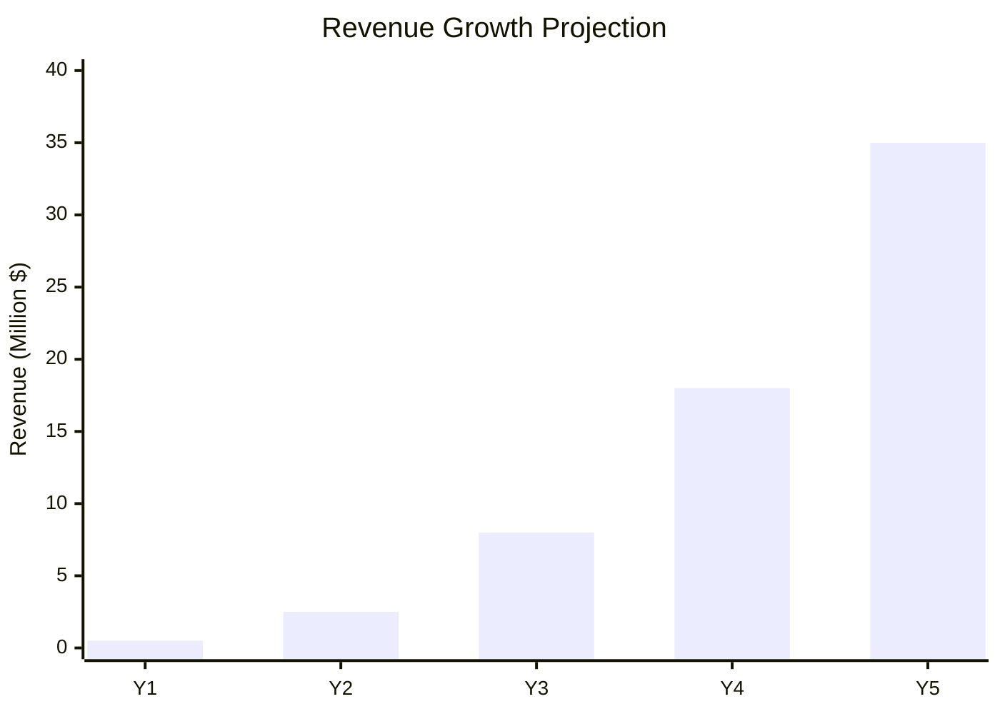

### 💎 Unit Economics Excellence
| Metric | Our Target | Industry Avg | Status |
|--------|------------|--------------|--------|
| **CAC** | $150 | $200 | ✅ 25% better |
| **LTV** | $4,500 | $3,000 | ✅ 50% better |
| **LTV/CAC** | 30:1 | 15:1 | ✅ 100% better |
| **Payback** | 8 months | 12 months | ✅ 33% faster |
| **Gross Margin** | 85% | 75% | ✅ 10%p higher |

### 🎯 Customer Growth
| Year | Teams | Average ACV | Total Revenue | Growth Rate |
|------|-------|-------------|---------------|-------------|
| **Y1** | 85 | $5,882 | $500K | - |
| **Y2** | 425 | $5,882 | $2.5M | **400%** |
| **Y3** | 1,360 | $5,882 | $8M | **220%** |

### 💰 Funding Requirements
#### Seed Round: $2M (2025 Q1)
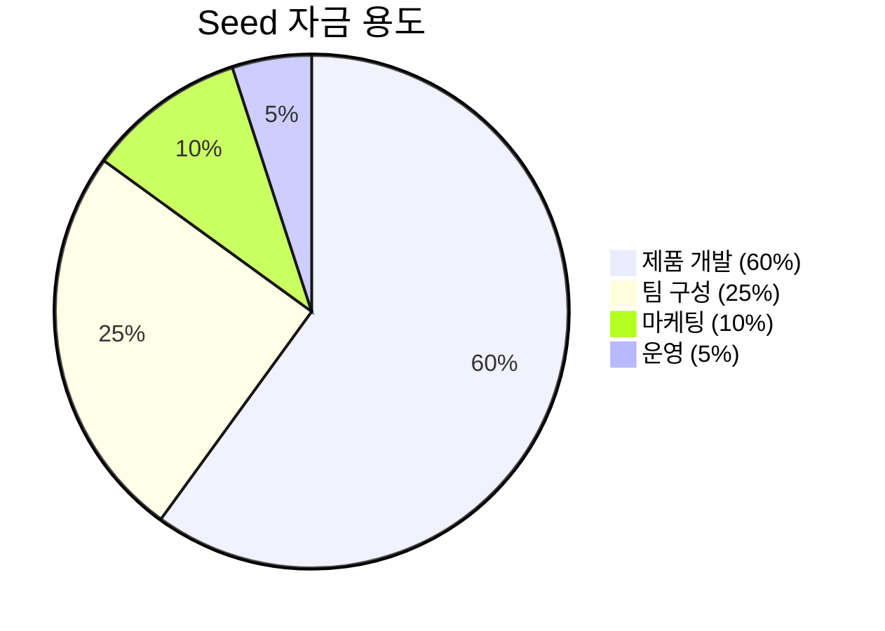

#### Series A: $10M (2026 Q2)  
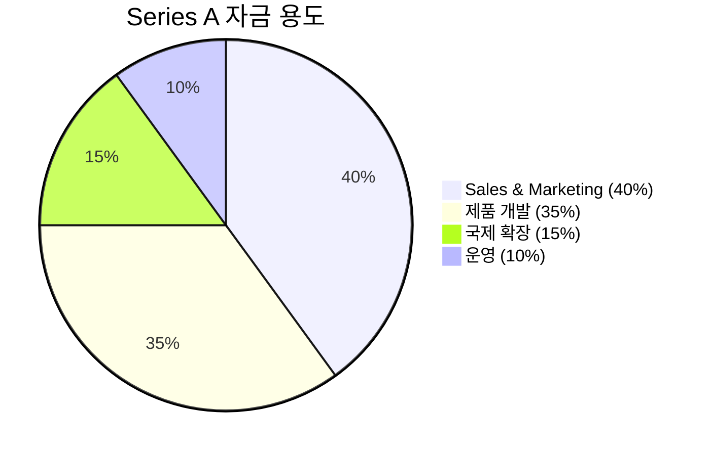

---

## 📊 Success Metrics & KPIs

### 🌟 North Star Metric
**개발자 생산성 향상률**: 40% by Year 1

### 📈 Key Performance Indicators

#### Business Metrics
| KPI | Current | Y1 Target | Y2 Target | Benchmark |
|-----|---------|-----------|-----------|-----------|
| **MRR** | $0 | $150K | $650K | - |
| **NRR** | - | 135% | 135% | 110% |
| **CAC Payback** | - | 8 months | 8 months | 12 months |

#### Product Metrics  
| KPI | Current | Q2 Target | Q4 Target | Y2 Target |
|-----|---------|-----------|-----------|-----------|
| **MAU** | 0 | 500 | 2,500 | 10,000 |
| **DAU/MAU** | - | 60% | 65% | 70% |
| **Response Time** | - | <1sec | <0.5sec | <0.3sec |

#### Customer Metrics
| KPI | Current | Target | Industry Best |
|-----|---------|--------|---------------|
| **NPS** | - | 60 | 70+ |
| **CSAT** | - | 4.5/5 | 4.7/5 |
| **Monthly Churn** | - | 2.5% | <2% |

### 🎯 Success Milestones
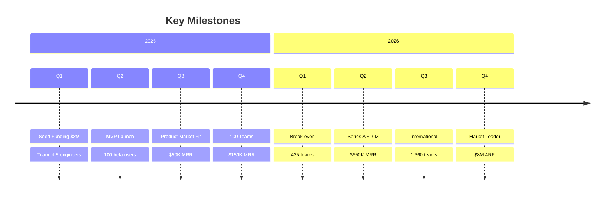

---

## ⚠️ Risk Assessment

### 🎯 Risk Matrix
| Risk | Probability | Impact | Mitigation Strategy |
|------|------------|--------|-------------------|
| **GitHub Copilot expansion** | 🔴 High | 🔴 High | 차별화 기능 강화, 빠른 혁신 |
| **Cursor growth slowdown** | 🟡 Medium | 🟡 Medium | 다른 IDE 지원 확대 |
| **AI accuracy limitations** | 🟡 Medium | 🔴 High | 멀티 모델 앙상블 |
| **Market downturn** | 🟡 Medium | 🟡 Medium | ROI 중심 마케팅 |

### 📊 Scenario Analysis (Y3 Revenue)
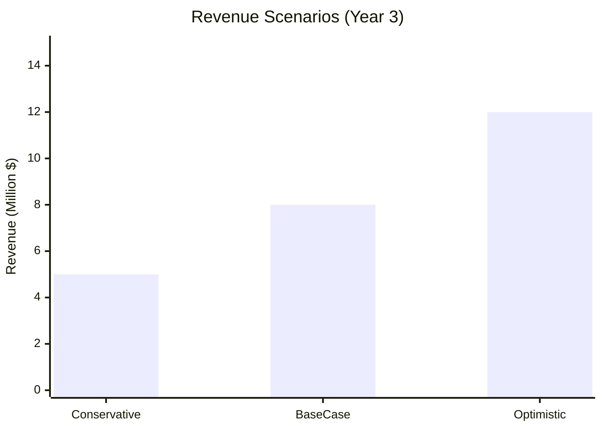

| Scenario | Revenue | Probability | Key Assumptions |
|----------|---------|-------------|-----------------|
| **Conservative** | $5M | 25% | 경쟁 심화, 느린 채택 |
| **Base Case** | $8M | **50%** | 계획대로 진행 |
| **Optimistic** | $12M | 25% | 빠른 성장, 조기 PMF |

---

## 🚀 Next Steps & Action Items

### 📅 Immediate Actions (Next 30 Days)
- [ ] **자금 조달**: Seed 투자자 5-7개 VC 미팅
- [ ] **팀 구성**: Backend Engineer 2명, AI Engineer 1명 채용
- [ ] **제품 개발**: Cursor Extension 개발 환경 구축
- [ ] **시장 조사**: 베타 테스터 50명 사전 확보

### 🎯 3-Month Goals
- [ ] **MVP 완성**: Cursor 네이티브 통합 + 실시간 리뷰
- [ ] **파일럿 고객**: 10개 팀 확보 및 피드백 수집
- [ ] **팀 확장**: 핵심 개발팀 8명 구성
- [ ] **시장 진입**: 개발자 커뮤니티 네트워킹 시작

### 🌟 6-Month Vision
- [ ] **제품-시장 적합성**: NPS 50+, $50K MRR
- [ ] **시장 인지도**: 개발자 컨퍼런스 참여, 기술 블로그
- [ ] **파트너십**: Cursor 팀과의 공식 파트너십 논의
- [ ] **Series A 준비**: 투자자 관계 구축 및 데이터 축적

---

## 📋 Executive Summary

### 🎯 Investment Thesis
**CodeReview AI**는 **$12.26B 규모로 성장하는 AI 코드 도구 시장**에서 **Cursor 개발자라는 명확한 타겟**과 **실시간 맥락 인식 AI**라는 차별화된 솔루션으로 **상당한 가치**를 창출할 수 있는 기회입니다.

### 💎 Key Success Factors
1. **🎯 명확한 타겟**: 50-500명 중견 기술 기업의 검증된 니즈
2. **🚀 차별화 기술**: Cursor 네이티브 + 실시간 AI 분석
3. **💰 검증된 모델**: 5년 내 $35M ARR, 85% Gross Margin
4. **⏰ 완벽한 타이밍**: AI 도구 급성장기 + Cursor 생태계 확장

### 🏆 Expected Impact
- **고객**: 개발 생산성 **40% 향상**, 연간 **$300K 절약**
- **시장**: 실시간 코드 리뷰 **업계 표준** 선도
- **투자자**: 3년 내 **567% ROI** 달성
- **팀**: AI 개발 도구 분야 **선도 기업** 구축

---

> **📞 Contact**: 추가 정보나 투자 문의는 언제든지 연락 주시기 바랍니다.  
> **📧 Email**: team@codereview-ai.com | **🌐 Website**: www.codereview-ai.com

**🚀 지금이 바로 시작할 때입니다!**
